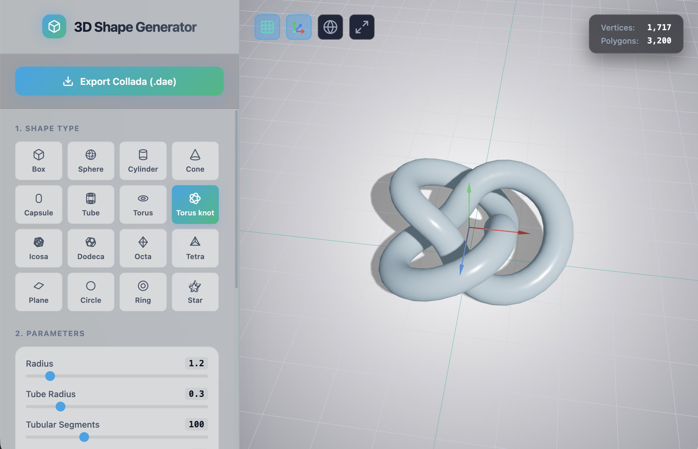

# 3D Shape Generator & Collada Exporter

A self-contained browser application for interactive 3D modeling, parametric shape customization, and instant Collada (`.dae`) model exports. Built using vanilla HTML5/CSS3 and Three.js.

**Live Demo:** [https://damir3.github.io/3DShapeGenerator/](https://damir3.github.io/3DShapeGenerator/)



## Key Features

### 1. 16 Parametric Geometric Primitives
Instantly generate and dynamically customize 16 different 3D shapes:
- **Box**: Customizable dimensions and segment subdivisions.
- **Sphere**: Variable radius, segment details, and arc sweeps.
- **Cylinder**: Adjust top/bottom radii, height, segments, and open/closed caps.
- **Cone**: Modify base radius, height, radial subdivisions, and open/closed caps.
- **Capsule**: Adjustable length, radius, and spherical cap segments.
- **Tube**: Extrude a hollow 2D ring profile vertically with custom bevel toggles, thickness, size, and segments.
- **Torus**: Customize torus ring radius and tube thickness.
- **Torus Knot**: Generate winding knots with customizable P/Q parameters.
- **Platonic & Archimedean Solids**: Customize detail and radius for **Icosahedron**, **Dodecahedron**, **Octahedron**, and **Tetrahedron**.
- **2D Shapes**: Generate flat-lying horizontal shapes including **Plane**, **Circle**, and **Ring**.
- **Star**: Extrude a 2D star profile with custom depth, bevel toggles, thickness, size, and segment controls.
<!-- - **Lathe**: Revolve a goblet-shaped sine-wave path around the Y-axis. -->

### 2. Material & Shading Customization
- **Vibrant Shading**: Standard materials with adjustable color (HEX color picker), roughness, and metalness.
- **Flat Shading**: Toggle a faceted, low-poly style.
- **UV Coordinate Grid Texture**: Toggle a procedural color checkerboard grid texture that maps onto shape surfaces.

### 3. Interactive Viewport & HUD Overlays
- **Orbit Controls**: Smooth mouse panning, rotation, and dampening.
- **HUD Overlays**:
  - **Real-time Counter**: Vertices and polygons count update instantly as sliders move.
  - **Toggle Grid**: Show or hide the ground grid floor.
  - **Toggle Axes**: Display self-illuminated Red (X), Green (Y), and Blue (Z) 3D coordinate axes (renders on top of all geometries and centers on the object's origin).
  - **Toggle Wireframe**: Switch the active shape between solid rendering and wireframe rendering mode.
  - **Reset Camera**: Camera and orbit pivot automatically snap to center on the shape's center.

### 4. Collada Export (.dae)
- Export the custom shape mesh directly to standard Collada format.
- Geometry rotations and floor translations are fully baked into the exported vertex coordinates.

## Getting Started

Browsers restrict ES Module imports (including local ones) when loading files directly via the `file://` protocol due to CORS safety guidelines. **You must run a local web server to open the application.**

### 1. Run a Local Server
In your terminal, navigate to the project directory and run one of the following commands:

#### Option A: Python (Built into macOS/Linux)
```bash
python3 -m http.server 8080
```

#### Option B: NodeJS / npx
```bash
npx -y http-server -p 8080
```

### 2. Launch the Application
Open your web browser and go to:
[http://localhost:8080/](http://localhost:8080/)
